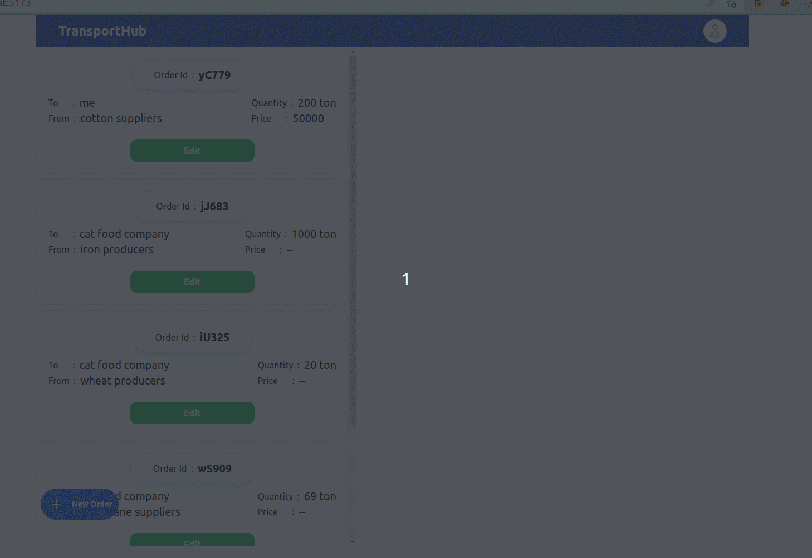
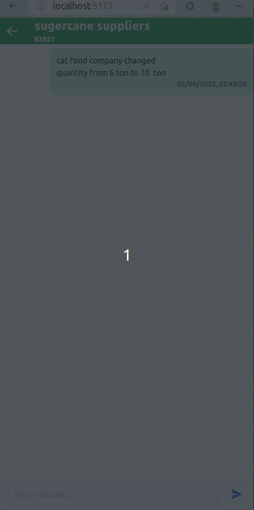
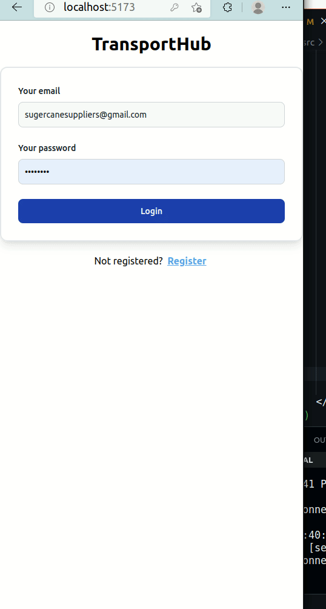

# Transport Hub

To connect Manufacturer and Transporter.

Through this app one Manufacturer can create and order, chat with the Transporters which will help increasing productivity.

Basic Working: 
1. For Manufacturer:
    - After login can see the list of all orders (where user is manufacturer)
    - Create new order
    - Update order ( can not update order_id and price )
    - 
    - Can chat with the transporter (Please refer to the attached file  02_messaging.gif)
    - 

2. For Transporter:
    - After login can see all the order (where user is transporter)
    - Update the price of orders
    - Send message to Manufacturer
    - 

Security:
1. Using token based authentication.
2. After login/registration frontend will be given a token which will be check for protected api endpoints
3. Only allowed owner/ user will be allowed to view / update their respective order.
    e.g. one can not view orders of other if it is not manufacturer/transporter

Libraries used:
1. React
2. Mongoose (for mongodb)
3. Express
4. Typescript: 
     - for type safety and ease in development
5. TailwindCSS:
    - to simplify styling
6. Express Validator:
    - it makes job of validating body parameters of post api lot easier
7. Bcryptjs:
    - to encrypt password
8. Jsonwebtoken:
    - to implement token based authentication
 
Improvement which can be done:
1. Websocket libraries like socket.io can be used to update the data in real time.
2. Styling can be improved
3. Other types of databases can be used to store the messages effectively. (I have used the indexes to make the query faster but still MongoDB is not the ideal solution for it).